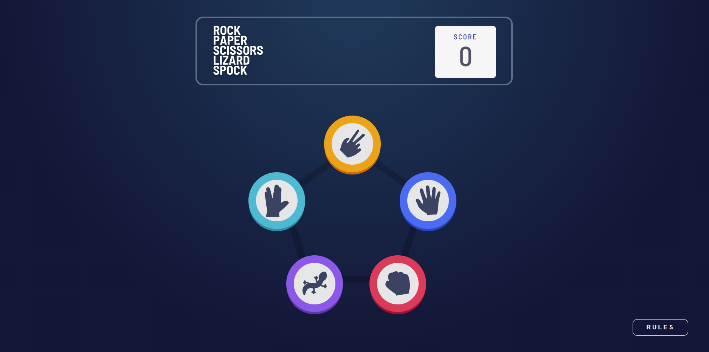
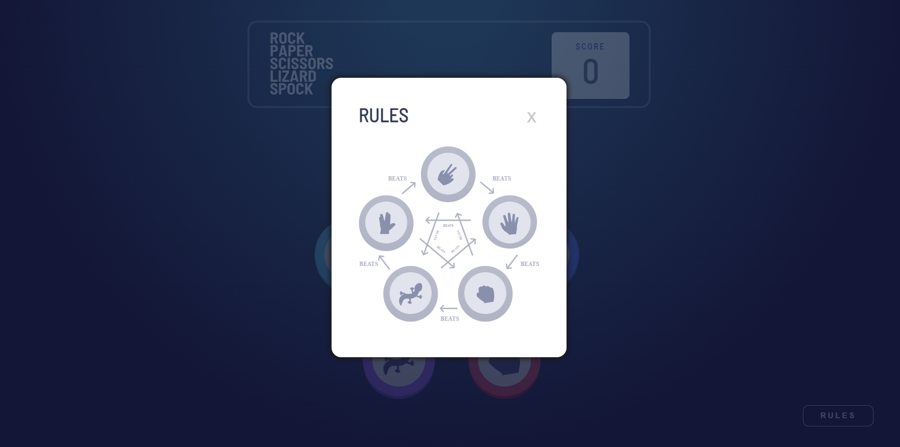
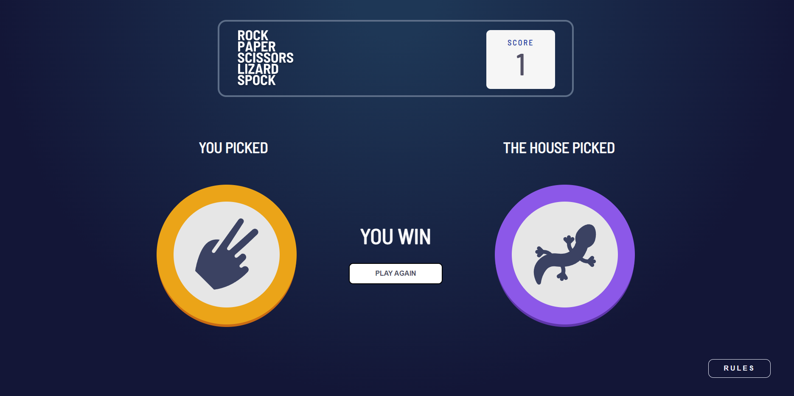
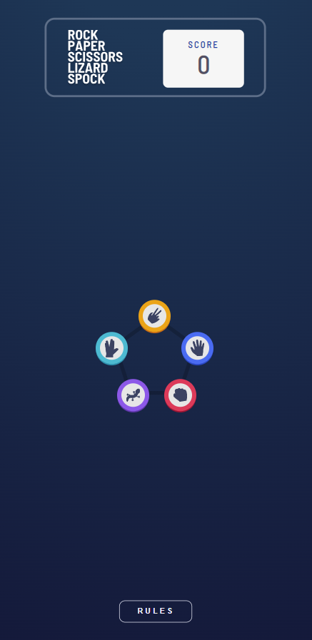
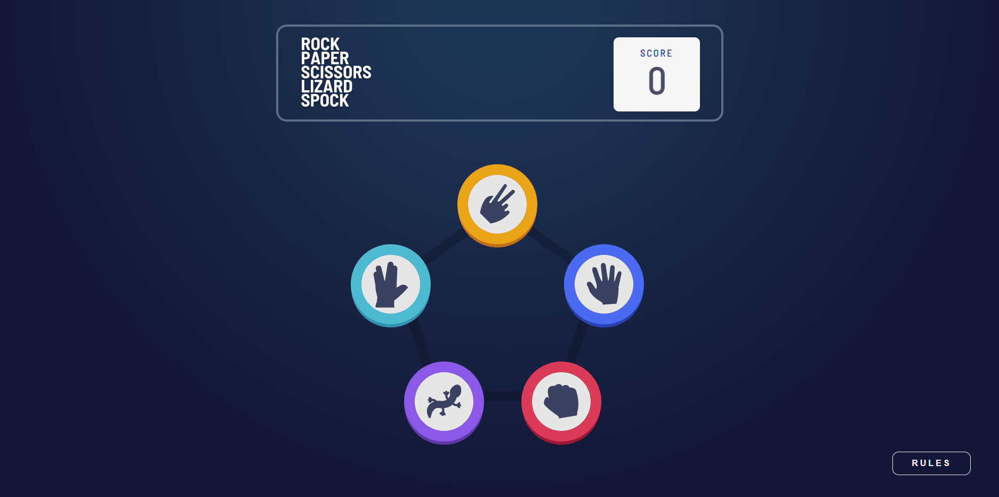

# Rock-Paper-Scissors

Esta é uma solução para o desafio [Rock, Paper, Scissors game](https://www.frontendmentor.io/challenges/rock-paper-scissors-game-pTgwgvgH) do site [Front End Mentor](https://www.frontendmentor.io/challenges), onde você escontra diversos desafios que vão te ajudar a melhorar o seu conhecimento no Front-End.

## Sumário

- [Resumo](#Resumo)
  - [Desafio](#Desafio)
  - [Screenshot](#screenshot)
  - [Link](#link)
- [Processo](#Processo)
  - [Construido com](#construido-com)
  - [O que eu aprendi](#o-que-eu-aprendi)
- [Autor](#autor)

## Resumo

O desafio é construir o projeto e deixá-lo o mais próximo possível do design oferecido. Podendo usar qualquer ferramenta para ajudar a concluir o desafio. O objetivo principal dessa página era criar um jogo tradicional e muito conhecido: O pedra, papel e tesoura. O front-end mentor te dá duas opções ao escolher esse projeto, o modo de jogo Bônus e o Tradicional. A diferença entres os dois está em quantos elementos de batalha teremos, no meu caso eu escolhi o projeto Bônus, então o jogo se torna Pedra, Papel, tesoura, lagartixa e spock. É identico ao jogo tradicional porém contém mais elementos. As regras do jogo são exatamente iguais, apenas acrescentando o caso de vítoria ou derrota dos itens novos, vocês podem entender isso melhor ao clicar no botão "rules" dentro do jogo. 


### Desafio

O site deveria ter uma boa usabilidade, um design fiel ao oferecido, e oferecer uma boa expêriencia ao usuário, vou destacar aqui alguns pontos importantes do desenvolvimento:


-Botão para ver as regras do jogo<br>
-Escolha de qual das opções você usará na disputa <br>
-Um Adversário que escolhe suas opções aleatóriamente <br>
-Lógica de vencedor ou perdedor <br>
-Exibir placar de pontuação<br>
-Design Responsivo <br>
-Emitir efeitos sonoros (Bônus criado por mim) <br>

### Screenshots

<p align="center"> Página inicial 
    </img>
</p>

------
<p align="center"> Página de Regras
    </img>
</p>

------
<p align="center"> Página de Disputa
    </img>
</p>

------
<p align="center"> Página em modo responsivo
    </img>
</p>

------

<p align="center"> Gif animado do site em funcionamento
    </img>
</p>

### Link: https://nicolasgabriiel.github.io/Rock-Paper-Scissors/

## Processo

### Construido com

-HTML5 <br>
-CSS3 <br>
-JavaScript <br>

### Principais coisas que aprendi

Adicionar trilhas de audio no html

```html
    <audio src="assets/sounds/trilha.mp3"></audio>
    <audio src="assets/sounds/winner.mp3"></audio>
    <audio src="assets/sounds/loser.mp3"></audio>
```

O radial-gradient que eu utilizei pra fazer o background da página

```css
background-image: radial-gradient(circle farthest-side at 50% 0%, #1E3756 10%, #131637 100%);
```

O atributo disabled que funciona em buttons e inputs

```js
        for(let i = 0; i < listaBotoes.length ; i ++){
         listaBotoes[i].disabled = false
        }
```

A função Math para gerar um número aleatório
```js
function gerarAleatório (min, max) {
    min = Math.ceil(1);
    max = Math.floor(5);
    codeHouse = Math.floor(Math.random() * (max - min + 1) + min);
}
```

A função .play() pra reproduzir um som
```js
sounds[1].play()
```

Usando setTimeout pra gerar tempo antes de uma função
```js
    setTimeout(gerarOponente, 3200)
```


## Autor

-  Site pessoal - [Nicolas Gabriel](https://www.linkedin.com/in/nicolasgabriiel/)


<div  align="center">

### Planejamento de Projeto:

</div>

- [X] Criar Repositório
- [X] Adicionar as imagens que serão usadas
- [X] Criar Background da Página
- [X] Estruturar Header
- [X] Importar Fonte
- [X] Estilizar Header
- [X] Esturural a Main principal
- [X] Estilizar a Main Principal
- [X] Estruturar o botão rules no footer
- [X] Estilizar o botão rules do footer
- [X] Receber o onclick do botão rules 
- [X] Criar Lógica pra desabiltar toda a página
- [X] Construir a lógica pra abrir nova tela
- [X] Estruturar nova tela
- [X] Estilizar nova tela de rules
- [X] Receber o onclik pra fechar
- [X] Criar Lógica pra habilitar a tela 
- [x] Construir a lógica pra fechar 
- [x] Arrumar todos os posicionamentos dos botões
- [X] Receber o input de todos os Botões principais
- [X] Exibir o background dos botões 
- [X] Criar lógica de selecionar
- [x] Estruturar section onde acontecerá a disputa
- [X] Criar Lógica de ocultar as sections quando um botão for clicado
- [x] Exibir a div oculta com o botão Selecionado
- [x] Estilizar section onde acontecerá a disputa
- [X] Criar lógica de escolher algum aleatóriamente
- [X] Criar Lógica de vencedor
- [X] Exibir o Resultado na tela
- [x] Receber o input do elemento play again
- [X] Criar lógica pra escolher novamente
- [x] Receber input de score
- [x] Criar Lógica de Score
- [x] Exibir e estilizar na tela o score
- [X] Aplicar o Responsivo na página principal
- [x] Aplicar o Responsivo na Página secundária
- [X] Aplicar o Responsivo na Aba Rules
- [X] Aplicar testes para ver se tudo funciona adequadamente
- [X] Corrigir possíveis bugs que apareçam na última etapa
- [X] Melhorar Sombras e tamanho dos botoes 
- [X] Criando um bom Readme para o projeto

### Bônus

- [X] Efeitos sonoros especiais
- [ ] Criar o efeito de background no vencedor
